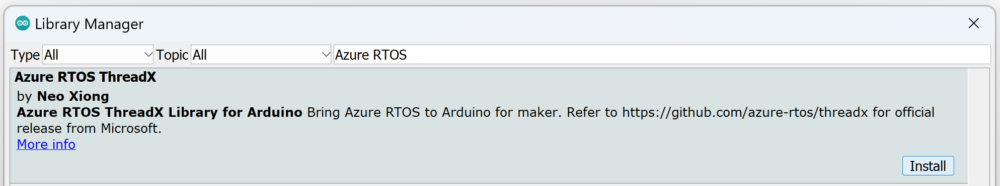
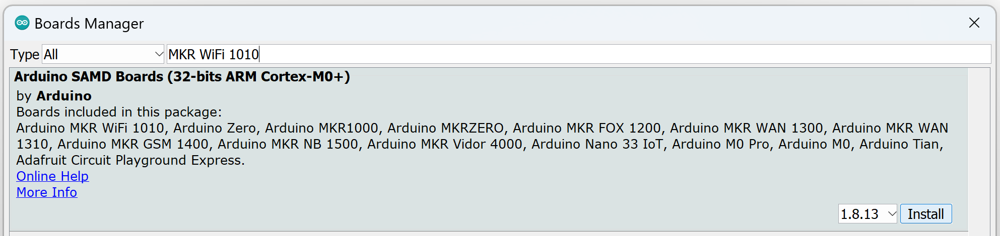
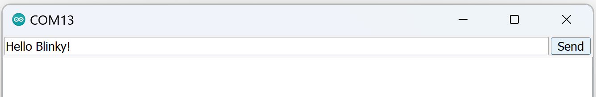

# Azure RTOS ThreadX for Arduino 101: Threads

Microsoft's Azure RTOS ThreadX is open source! We want to show you the basics of ThreadX so you can start using this industrial-grade RTOS in your Arduino personal projects.

**Total completion time**:  45 minutes

- [Azure RTOS ThreadX for Arduino 101: Threads](#azure-rtos-threadx-for-arduino-101-threads)
  - [Introduction](#introduction)
    - [What is covered](#what-is-covered)
    - [Prerequisites](#prerequisites)
  - [Setup](#setup)
  - [Part 1: Run the Arduino Blink example](#part-1-run-the-arduino-blink-example)
    - [Deep Dive](#deep-dive)
  - [Part 2: Convert the Blink example via ThreadX](#part-2-convert-the-blink-example-via-threadx)
    - [Deep Dive](#deep-dive-1)
  - [Part 3: Apply multi-threading to the Blink example via ThreadX](#part-3-apply-multi-threading-to-the-blink-example-via-threadx)
    - [Deep Dive](#deep-dive-2)
  - [Further Reading](#further-reading)
  
## Introduction

This tutorial will show you how to use multi-threading with Azure RTOS Threadx for Arduino. You will start with the classic Blink example and convert it.

**_Azure RTOS_**: A Microsoft development suite for embedded IoT applications on microcontrollers (MCUs). [Azure RTOS](https://azure.microsoft.com/products/rtos) can be used **independent** of Microsoft's [Azure](https://azure.microsoft.com/resources/cloud-computing-dictionary/what-is-azure) cloud platform.

**_Azure RTOS ThreadX_**: One component of the Azure RTOS product offering. [ThreadX](https://learn.microsoft.com/azure/rtos/threadx/overview-threadx) is the real time operating system (RTOS) designed to run on MCUs.

**_Azure RTOS ThreadX for Arduino_**: A port of Azure RTOS ThreadX to Arduino as a library. Please visit [AzureRTOS-ThreadX-For-Arduino](https://github.com/xiongyu0523/AzureRTOS-ThreadX-For-Arduino) on GitHub for the [source code](https://github.com/xiongyu0523/AzureRTOS-ThreadX-For-Arduino/tree/main/src).

### What is covered
By the end of this tutorial, you should understand the following:

**Terms**: kernel, thread, thread control block, priority level, preemption, preemption threshold

**Actions**: How to implement a single thread using ThreadX; How to implement multiple threads using ThreadX
  
**Final code**: View the full ThreadX multi-threaded Blink code example on [GitHub](<to do>).

### Prerequisites
- Have the [Arduino IDE 1.8.x](https://www.arduino.cc/en/software) installed.
- Have a device using an [ATSAMD21 or ATSAMD51](https://www.microchip.com/en-us/products/microcontrollers-and-microprocessors/32-bit-mcus/sam-32-bit-mcus/sam-d) chip. View this [list](https://github.com/xiongyu0523/AzureRTOS-ThreadX-For-Arduino/tree/main#hardware-support) of verified boards.

_The following was run on Windows 11, Arduino IDE 1.8.19, and the Arduino MKR WiFi 1010._

## Setup

1. Open the Arduino IDE.

2. Install the Azure RTOS Arduino library.

    - Navigate to **Tools > Manage Libraries...**
    - Search for **'Azure RTOS'**. 
    - Install **'Azure RTOS ThreadX'**.  _Be sure to install the latest version._

        

3. Install the board package for your device. (_This sample uses the Arduino MKR WiFi 1010._)

    - Navigate to **Tools > Board: ... > Boards Manager...**
    - Search for **'MKR WiFi 1010'**.
    - Install **'Arduino SAMD Boards (32-bits ARM Cortex-M0+)'**. _Be sure to install the latest version._

        
   
## Part 1: Run the Arduino Blink example
In this section we will run the traditional Blink example to confirm the device is setup properly.

1. Open the Blink example.

    - Navigate to **File > Examples > 01.Basics**.
    - Select **'Blink'**.
    
2. Connect your device.
   
   - Plug in your device to your PC.
   - Navigate to **Tools > Board: ... > Arduino SAMD Boards (32-bits ARM Cortex-M0+)**
   - Select **'Arduino MKR WiFi 1010'**.
   - Navigate to **Tools > Port**.
   - Select **'\<Port associated with device\>'**.

3. Run the example.
   
   - In the top left corner, select the **'Upload'** icon. _Verification will automatically occur first._
   - Observe the LED blink on and off every 1 second.

### Deep Dive

<details><summary><i>Code</i></summary>
<p>

```
// the setup function runs once when you press reset or power the board
void setup() {
  // initialize digital pin LED_BUILTIN as an output.
  pinMode(LED_BUILTIN, OUTPUT);
}

// the loop function runs over and over again forever
void loop() {
  digitalWrite(LED_BUILTIN, HIGH);   // turn the LED on (HIGH is the voltage level)
  delay(1000);                       // wait for a second
  digitalWrite(LED_BUILTIN, LOW);    // turn the LED off by making the voltage LOW
  delay(1000);                       // wait for a second
}
```

See full Arduino [Blink](https://www.arduino.cc/en/Tutorial/BuiltInExamples/Blink) example for more information.

</p>
</details>

<details><summary><i>What is going on?</i></summary>
<p>

Arduino makes use of two core functions: [`setup()`](https://www.arduino.cc/reference/en/language/structure/sketch/setup/) and [`loop()`](https://www.arduino.cc/reference/en/language/structure/sketch/loop/). Once `setup()` completes, `loop()` is internally kicked off and runs the remainder of the program. Because there is no RTOS present, this code can be considered _bare metal_ programming.   

See full Arduino [Blink](https://www.arduino.cc/en/Tutorial/BuiltInExamples/Blink) example for more information.

</p>
</details>

## Part 2: Convert the Blink example via ThreadX
In this section we will convert the bare metal Blink example to a single-threaded RTOS version using ThreadX.

1. Save the example. 

    - Navigate to **File > Save As**.
    - Save the sketch as **'Blink_ThreadX'**.

2. (1) Add the Azure RTOS ThreadX library header file `tx_api.h` near the top of the file. Place it after the commentary, but before the `setup()` function.

    ```
    /* (1) Include the Azure RTOS ThreadX library header file. */
    #include <tx_api.h>
    ```

    <details><summary><i>What is going on?</i></summary>
    <p>

    [`tx_api.h`](https://github.com/xiongyu0523/AzureRTOS-ThreadX-For-Arduino/blob/main/src/tx_api.h) is the only header file you need to include to use ThreadX for Arduino. `tx` is short for ThreadX. All functions in the API will begin with `tx`. All constatnts and data types will begin with `TX`. 

    </p>
    </details>

3. (2) Add the **_kernel_** entry function `tx_kernel_enter()` to `setup()`.

    ```
    // the setup function runs once when you press reset or power the board
    void setup() {
      // initialize digital pin LED_BUILTIN as an output.
      pinMode(LED_BUILTIN, OUTPUT);

      /* (2) Add the kernel entry function. */
      tx_kernel_enter();
    }   
    ```

    <details><summary><i>What is going on?</i></summary>
    <p>

    The **_kernel_** is the core component of an RTOS. Think of it as the lead coordinator or director of logistics for a project. By "entering" the kernel, the RTOS kernel can start running and managing your embedded application. 
    
    The program will never return from `tx_kernel_enter()`. As a result, the application will not return from `setup()` and `loop()` will not be called. 

    > IMPORTANT: _"The call to tx_kernel_enter() does not return, so do not place any processing after it."_

    Please see [Microsoft Learn's ThreadX Chapter 3: Functional Components of ThreadX](https://learn.microsoft.com/azure/rtos/threadx/chapter3) for more information on [`tx_kernel_enter()`](https://learn.microsoft.com/azure/rtos/threadx/chapter3#main-function).

    </p>
    </details>

4. (3) Add the **_thread_** stack memory and the **_thread control block_**. Place this near the top of the file after `#include <tx_api.h>` and before `setup()`.

    ```
    /* (3) Add the thread stack memory and thread control block. */
    #define THREAD_STACK_SIZE 512

    TX_THREAD thread_0;
    UCHAR thread_0_stack[THREAD_STACK_SIZE];

    ```

    <details><summary><i>What is going on?</i></summary>
    <p>

    A **_thread_** is a specific execution path within a process (i.e., a running application). A thread shares memory space with other threads but has its own allocated stack space. We define this stack size to be `THREAD_STACK_SIZE` bytes and use the array `thread_0_stack` to allocate the memory. Please see [Microsoft Learn's ThreadX Chapter 3: Functional Components of ThreadX](https://learn.microsoft.com/azure/rtos/threadx/chapter3) for more information on the [thread stack area](https://learn.microsoft.com/azure/rtos/threadx/chapter3#thread-stack-area). 

    A **_thread control block_** contains specific data for the thread. `TX_THREAD` is the ThreadX data type for a thread control block. Please see [Microsoft Learn's ThreadX Chapter 3: Functional Components of ThreadX](https://learn.microsoft.com/azure/rtos/threadx/chapter3) for more information on [`TX_THREAD`](https://learn.microsoft.com/azure/rtos/threadx/chapter3#thread-control-block-tx_thread).

    > IMPORTANT: _"ThreadX does not use the term task. Instead, the more descriptive and contemporary name thread is used."_ Please see [Microsoft Learn's ThreadX Chapter 1: Introduction to ThreadX](https://learn.microsoft.com/azure/rtos/threadx/chapter1) for more information on [tasks vs. threads](https://learn.microsoft.com/azure/rtos/threadx/chapter1#tasks-vs-threads).

    </p>
    </details>

5. (4) Define the thread's entry function `thread_0_entry()`. Place the function definition after the `thread_0_stack` array and before `setup()`.
   
    ```
    /* (4) Define the thread's entry function. */
    void thread_0_entry(ULONG thread_input)
    {
      (VOID)thread_input;

      while(1)
      {
        /* Add thread logic to execute here. */
      }
    }
    ```

    <details><summary><i>What is going on?</i></summary>
    <p>

    The thread's entry function is called by the kernel and contains the thread execution logic. Typically, this function will contain an infinite loop (i.e., `while(1)`) that will execute throughout the running program. _The name of this function is determined by the user_. 

    </p>
    </details>

6. (5) Move the LED blink logic from `loop()` into the thread's entry function.  Replace the `delay(1000)` with `tx_thread_sleep(TX_TIMER_TICKS_PER_SECOND)`.
   
    ```
    void thread_0_entry(ULONG thread_input)
    {
      (VOID)thread_input;

      while(1)
      {
        /* (5) Move the LED blink logic into the thread's entry function. */
        digitalWrite(LED_BUILTIN, HIGH);            // turn the LED on
        tx_thread_sleep(TX_TIMER_TICKS_PER_SECOND); // wait for a second
        digitalWrite(LED_BUILTIN, LOW);             // turn the LED off
        tx_thread_sleep(TX_TIMER_TICKS_PER_SECOND); // wait for a second
      }
    }
    ```

    ```
    // the loop function runs over and over again forever
    void loop() {
      /* (5) Move the LED blink logic into the thread's entry function. */
      /* This will never be called. */
    }
    ```

    <details><summary><i>What is going on?</i></summary>
    <p>

    Because `loop()` will no longer be called, the blink logic must be moved into the new thread. The [`delay()`](https://www.arduino.cc/reference/en/language/functions/time/delay/) function has limitations and since we will later want to suspend the thread to allow other threads to execute, we will use ThreadX's [`tx_thread_sleep()`](https://learn.microsoft.com/azure/rtos/threadx/chapter4#tx_thread_sleep) function instead. This function takes timer ticks as its parameter instead of milliseconds.

    </p>
    </details>

7. (6) Add the application's environment setup function `tx_application_define()`. Place this function after `thread_0_entry()` and before `setup()`.

    ```
    /* (6) Add the application's environment setup function. */
    void tx_application_define(void *first_unused_memory)
    {
      (VOID)first_unused_memory;

      /* Put system definition stuff in here, e.g. thread creates and other assorted
         create information.  */
    }
    ```

    <details><summary><i>What is going on?</i></summary>
    <p>

    The kernal entry function `tx_kernel_enter()` will call the function `tx_application_define()` to setup the application environment and system resources. _It is the user's responsibility to implement this function_ with the logic to create system resources for the RTOS environment.   

    Please see [Microsoft Learn's ThreadX Chapter 3: Functional Components of ThreadX](https://learn.microsoft.com/azure/rtos/threadx/chapter3) for more information on [`tx_application_define()`](https://learn.microsoft.com/azure/rtos/threadx/chapter3#application-definition-function).
    
    </p>
    </details>

8. (7) Create the thread with `tx_thread_create()`. Add this function call to `tx_application_define()`.

    ```
    void tx_application_define(void *first_unused_memory)
    {
      (VOID)first_unused_memory;

      /* Put system definition stuff in here, e.g. thread creates and other assorted
         create information.  */

      /* (7) Create the thread. */
      tx_thread_create(&thread_0, "thread 0", thread_0_entry, 0,  
        thread_0_stack, THREAD_STACK_SIZE, 
        1, 1, TX_NO_TIME_SLICE, TX_AUTO_START);
    }
    ```

    <details><summary><i>What is going on?</i></summary>
    <p>

    [`tx_thread_create()`](https://learn.microsoft.com/azure/rtos/threadx/chapter4#tx_thread_create) creates a thread with specified arguments. The arguments used in this example reflect the following:

    - `&thread_0` : Pointer to the defined thread control block. (See step 3.)
    - `"thread_0"` : The thread name (i.e., pointer to the name.)  
    - `thread_0_entry` : The user-defined thread entry function. (See step 4.)
    - `0` : Entry input to the thread. _We are not utilizing this argument_.
    - `thread_0_stack` : Pointer to the start of the thread's stack. (See step 3.)
    - `THREAD_STACK_SIZE`: Size of the thread's stack in bytes. (See step 3.)
    - `1` : The **_priority level_** of the thread.
    - `1` : The **_preemption threshold_** of the thread.
    - `TX_NO_TIME_SLICE` : Time slicing is disabled.
    - `TX_AUTO_START` : The thread is automatically started.
    
    </br>

    The **_priority level_** of a thread helps the thread scheduler determine what thread to execute next. Some threads may be more critical to execute and are therefore given a higher priority relative to others. ThreadX has 32 default priority levels from 0 to 31, with 0 being the highest priority and 31 being the lowest.
    
    **_Preemption_** refers to an existing thread's execution being stopped so a higher priorty can run instead. The scheduler controls this and when the interrupting thread completes, execution returns back to the thread that was suspended. 
    
    The **_preemption threshold_** is unique to ThreadX. Only priorities higher than this threshold may preempt the thread.

    Please see [Microsoft Learn's ThreadX Chapter 3: Functional Components of ThreadX](https://learn.microsoft.com/azure/rtos/threadx/chapter3) for more information on [thread execution](https://learn.microsoft.com/azure/rtos/threadx/chapter3#thread-execution-1), [thread priorities](https://learn.microsoft.com/azure/rtos/threadx/chapter3#thread-priorities), [thread scheduling](https://learn.microsoft.com/azure/rtos/threadx/chapter3#thread-scheduling), and [thread preemption](https://learn.microsoft.com/azure/rtos/threadx/chapter3#preemption).

    </p>
    </details>

9. (8) Run the Blink example using Azure RTOS ThreadX.  

Follow the _2. Connect your device_ and _3. Run the example_ steps from [Part 1: Run the Arduino Blink example](#part-1-run-the-arduino-blink-example).
   
### Deep Dive

<details><summary><i>Code</i></summary>
<p>

```
/* (1) Add the Azure RTOS ThreadX library header file. */
#include <tx_api.h>

/* (3) Add the thread stack memory and thread control block. */
#define THREAD_STACK_SIZE 512

TX_THREAD thread_0;
UCHAR thread_0_stack[THREAD_STACK_SIZE];

/* (4) Define the thread's entry function. */
void thread_0_entry(ULONG thread_input)
{
  (VOID)thread_input;

  while(1)
  {
    /* (5) Move the LED blink logic into the thread's entry function. */
    digitalWrite(LED_BUILTIN, HIGH);            // turn the LED on
    tx_thread_sleep(TX_TIMER_TICKS_PER_SECOND); // wait for a second
    digitalWrite(LED_BUILTIN, LOW);             // turn the LED off
    tx_thread_sleep(TX_TIMER_TICKS_PER_SECOND); // wait for a second  
  }
}

/* (6) Add the application's environment setup function. */
void tx_application_define(void *first_unused_memory)
{
  (VOID)first_unused_memory;

  /* Put system definition stuff in here, e.g. thread creates and other assorted
     create information.  */

  /* (7) Create the thread. */
  tx_thread_create(&thread_0, "thread 0", thread_0_entry, 0,  
    thread_0_stack, THREAD_STACK_SIZE, 
    1, 1, TX_NO_TIME_SLICE, TX_AUTO_START);
}

// the setup function runs once when you press reset or power the board
void setup() {
  // initialize digital pin LED_BUILTIN as an output.
  pinMode(LED_BUILTIN, OUTPUT);

  /* (2) Add the kernel entry function. */
  tx_kernel_enter();
} 

// the loop function runs over and over again forever
void loop() {
  /* (5) Move the LED blink logic into the thread's entry function. */
  /* This will never be called. */
}
```

</p>
</details>

<details><summary><i>What is going on?</i></summary>
<p>

The code above demonstrates how to replace the Arduino bare metal single-threaded approach of `setup()` and `loop()` with Azure RTOS ThreadX. 

The prior bare metal code flow was:

- `setup()` -> `loop()` -> infinite loop Blink logic.

The ThreadX new code flow is:

- `setup()` -> `tx_kernel_enter()` -> `tx_application_define()` -> `thread_0_entry()` -> infinite loop Blink logic.

Although this approach still maintains the same single-threaded functionality, it is now setup to add additional threads as needed. Part 3 will demonstrate how to do this.

</p>
</details>

## Part 3: Apply multi-threading to the Blink example via ThreadX
In this section we will use the single-threaded ThreadX Blink code to create a multi-threaded version that also reads serial input. 

1. Save the example.

    - Navigate to **File > Save As**.
    - Save the sketch as **'Blink_SerialRead_ThreadX'**.
     
2. (8) Add the **_thread_** stack memory and the **_thread control block_** for _one_ more thread.

    ```
    /* (3)(8) Add the thread stack memory and thread control block. */
    #define THREAD_STACK_SIZE 512

    TX_THREAD thread_0;
    TX_THREAD thread_1;

    UCHAR thread_0_stack[THREAD_STACK_SIZE];
    UCHAR thread_1_stack[THREAD_STACK_SIZE];
    ```

    <details><summary><i>What is going on?</i></summary>
    <p>

    This action mimics _Part 2: Step 3_. For each **_thread_** you want to add, you will need to allocate its stack memory and declare its **_thread_control block_** `TX_THREAD`.

    </p>
    </details>
    <br/>

3. (9) Define the new thread's entry function `thread_1_entry()`. Place the function after `thread_0_entry()` and before `tx_application_define()`.

    ```
    /* (9) Define the thread's entry function. */
    void thread_1_entry(ULONG thread_input)
    {
      (VOID)thread_input;

      while(1)
      {
        /* Add thread logic to execute here. */
      }
    }
    ```

    <details><summary><i>What is going on?</i></summary>
    <p>

    This action mimics _Part 2: Step 3_. Each thread needs a user-defined entry function to execute the thread logic.

    </p>
    </details>
    <br/>

4. (10) Add serial read logic into the thread's entry function.

    ```
    void thread_1_entry(ULONG thread_input)
    {
      (VOID)thread_input;

      /* (10) Add serial read logic to the thread's entry function. */
      Serial.begin(115200);
      
      while(1)
      {
        if (Serial.available() > 0)
        {
          char byte_read = Serial.read();
          Serial.print(byte_read);
        }
      }
    }
    ```

    <details><summary><i>What is going on?</i></summary>
    <p>

    The serial read logic receives bytes from serial input and prints them to the serial monitor. Notice this logic is placed within `while(1)`, but the serial initialization `Serial.begin()` function is not. Because initialization only needs to occur once, it is placed before `while(1)`.  Alternatively, it could be placed in `setup()` prior to `tx_kernel_enter()`.

    </p>
    </details>
    <br/>

5. (11) Create the new thread with `tx_thread_create()`. Add this function call to `tx_application_define()` after the creation of `thread_0`.

    ```
    void tx_application_define(void *first_unused_memory)
    {
      (VOID)first_unused_memory;

      /* Put system definition stuff in here, e.g. thread creates and other assorted
         create information.  */

      /* (7)(11) Create the thread. */
      tx_thread_create(&thread_0, "thread 0", thread_0_entry, 0,  
        thread_0_stack, THREAD_STACK_SIZE, 
        1, 1, TX_NO_TIME_SLICE, TX_AUTO_START);

      tx_thread_create(&thread_1, "thread 1", thread_1_entry, 0,  
        thread_1_stack, THREAD_STACK_SIZE, 
        4, 4, TX_NO_TIME_SLICE, TX_AUTO_START);
    }
    ```

    <details><summary><i>What is going on?</i></summary>
    <p>

    This action mimics _Part 2: Step 7_. The differences are found in the arguments used. Notice how naming has changed to reflect `thread_1`:

    - `&thread_1` : Pointer to the defined thread control block.
    - `"thread_1"` : The thread name (i.e., pointer to the name).
    - `thread_1_entry` : The user-defined thread entry function.
    - `thread_1_stack` : Pointer to the start of the thread's stack.

    <br>

    Another argument set that has changed is the **_priority level_** and **_preemption threshold_**:

    - `4` : The **_priority level_** of the thread.
    - `4` : The **_preemption threshold_** of the thread.

    Because _4_ is a lower priority level than _1_, `thread_0` will execute first, and only when it suspends (`tx_thread_sleep()`) will the scheduler execute the thread next in line (`thread_1`). Once `thread_0` has completed its suspension, the scheduler will preempt `thread_1` and return execution to `thread_0`.

    <br>

    The arguments that remain the same are:

    - `0` : Entry input to the thread.
    - `THREAD_STACK_SIZE` : Size of the thread's stack in bytes.
    - `TX_NO_TIME_SLICE` : Time slicing is disabled.
    - `TX_AUTO_START` : The thread is automatically started.

    </p>
    </details>

6. Run the multi-threaded Blink example using Azure RTOS ThreadX.

    - Follow the _2. Connect your device_ and _3. Run the example_ steps from [Part 1: Run the Arduino Blink example](#part-1-run-the-arduino-blink-example).
    - Observe the LED blink on and off every 1 second.
    - Navigate to **Tools > Serial Monitor**.
    - Type _Hello Blinky!_ into the serial input line.

        

    - Select **'Send'**.

        

   
### Deep Dive

<details><summary><i>Code</i></summary>
<p>

```
/* (1) Add the Azure RTOS ThreadX library header file. */
#include <tx_api.h>

/* (3)(8) Add the thread stack memory and thread control block. */
#define THREAD_STACK_SIZE 512

TX_THREAD thread_0;
TX_THREAD thread_1;

UCHAR thread_0_stack[THREAD_STACK_SIZE];
UCHAR thread_1_stack[THREAD_STACK_SIZE];

/* (4) Define the thread's entry function. */
void thread_0_entry(ULONG thread_input)
{
  (VOID)thread_input;

  while(1)
  {
    /* (5) Move the LED blink logic into the thread's entry function. */
    digitalWrite(LED_BUILTIN, HIGH);            // turn the LED on
    tx_thread_sleep(TX_TIMER_TICKS_PER_SECOND); // wait for a second
    digitalWrite(LED_BUILTIN, LOW);             // turn the LED off
    tx_thread_sleep(TX_TIMER_TICKS_PER_SECOND); // wait for a second  
  }
}

/* (9) Define the thread's entry function. */
void thread_1_entry(ULONG thread_input)
{
  (VOID)thread_input;

  /* (10) Add serial read logic to the thread's entry function. */
  Serial.begin(115200);
  
  while(1)
  {
    if (Serial.available() > 0)
    {
      char byte_read = Serial.read();
      Serial.print(byte_read);
    }
  }
}

/* (6) Add the application's environment setup function. */
void tx_application_define(void *first_unused_memory)
{
  (VOID)first_unused_memory;

  /* Put system definition stuff in here, e.g. thread creates and other assorted
     create information.  */

  /* (7)(11) Create the thread. */
  tx_thread_create(&thread_0, "thread 0", thread_0_entry, 0,  
    thread_0_stack, THREAD_STACK_SIZE, 
    1, 1, TX_NO_TIME_SLICE, TX_AUTO_START);

  tx_thread_create(&thread_1, "thread 1", thread_1_entry, 0,  
    thread_1_stack, THREAD_STACK_SIZE, 
    4, 4, TX_NO_TIME_SLICE, TX_AUTO_START);
}

// the setup function runs once when you press reset or power the board
void setup() {
  // initialize digital pin LED_BUILTIN as an output.
  pinMode(LED_BUILTIN, OUTPUT);

  /* (2) Add the kernel entry function. */
  tx_kernel_enter();
} 

// the loop function runs over and over again forever
void loop() {
  /* (5) Move the LED blink logic into the thread's entry function. */
  /* This will never be called. */
}
```

</p>
</details>

<details><summary><i>What is going on?</i></summary>
<p>

The code above demonstrates how to add an additional thread to an Arduino application using Azure RTOS ThreadX. Threads are very helpful to execute different tasks simultaneously, yet independently of each other.

Although not demonstrated in this tutorial, threads can also by synchronized and communicate with one another. This can be useful when a program needs to be available to receive incoming data at any time, but also needs to process it.  These two tasks can be split across two threads.

We hope to introduce these and other concepts in future tutorials for Azure RTOS ThreadX for Arduino. Stay tuned!

</p>
</details>

## Further Reading
Please visit [What is Azure RTOS ThreadX? | Microsoft Learn](https://learn.microsoft.com/azure/rtos/threadx/) to learn more.
