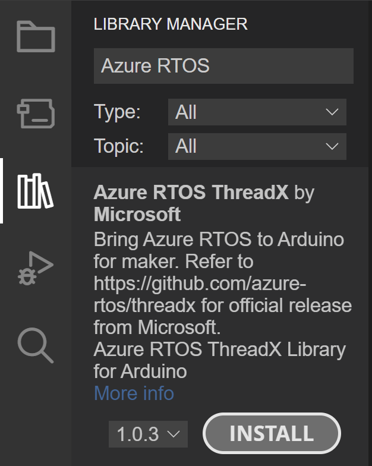
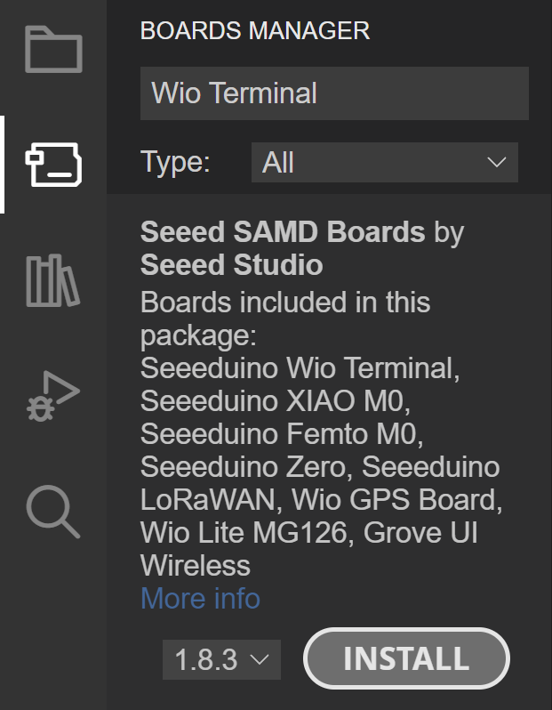

# Azure RTOS ThreadX for Arduino 102: Message Queues and Mutexes

Microsoft's Azure RTOS ThreadX is [available to use](https://aka.ms/hackster/ThreadX/hardware-license)! We want to introduce you to thread communication and synchronization in ThreadX so you can use this industrial-grade RTOS in your Arduino projects.

**Estimated Time:** 1 hour
- **Setup:** 5 min
- **Part 1:** 15 min
- **Part 2:** 15 min
- **Part 3:** 15 min
- **Part 4:** 15 min

**Estimated Cost:** $ of a [Seeed Wio Terminal](https://wiki.seeedstudio.com/Wio-Terminal-Getting-Started/)

**_IMPORTANT_:** Please view the [full license disclosure](https://aka.ms/hackster/ThreadX/full-license). ThreadX is available to use only for non-commercial and evaluation purposes, with the exception of full use for the [licensed hardware](https://aka.ms/hackster/ThreadX/hardware-license).

**Table of Contents:**
- [Azure RTOS ThreadX for Arduino 102: Message Queues and Mutexes](#azure-rtos-threadx-for-arduino-102-message-queues-and-mutexes)
  - [Introduction](#introduction)
    - [What is covered](#what-is-covered)
    - [Prerequisites](#prerequisites)
  - [Setup](#setup)
  - [Part 1: Thread design and creation](#part-1-thread-design-and-creation)
    - [Deep Dive](#deep-dive)
  - [Part 2: General logic implementation](#part-2-general-logic-implementation)
    - [Setup implementation](#setup-implementation)
    - [Thread logic implementation](#thread-logic-implementation)
  - [Part 3: Message queues](#part-3-message-queues)
  - [Part 4: Mutexes](#part-4-mutexes)
    - [Test the application without a mutex](#test-the-application-without-a-mutex)
    - [Test the application with a mutex](#test-the-application-with-a-mutex)
  - [Further Reading](#further-reading)

## Introduction

This tutorial is part of a series introducing you to multi-threading with Azure RTOS ThreadX for Arduino. The first tutorial [Azure RTOS ThreadX for Arduino 101: Threads](https://www.hackster.io/485734/azure-rtos-threadx-for-arduino-101-threads-963a8d) introduced thread creation and execution in an Arduino environment. This tutorial will demonstrate thread communication and synchronization via a [Wio Terminal](https://wiki.seeedstudio.com/Wio-Terminal-Getting-Started/) light-monitoring app, complete with user interaction and LCD screen output.

**_Azure RTOS_**: A Microsoft development suite for embedded IoT applications on microcontrollers (MCUs). [Azure RTOS](http://aka.ms/hackster/azurertos) **does not** require [Azure](https://azure.microsoft.com/resources/cloud-computing-dictionary/what-is-azure) to run.

**_Azure RTOS ThreadX_**: One component of the Azure RTOS product offering. [ThreadX](https://aka.ms/hackster/ThreadX) is the real time operating system (RTOS) designed to run on MCUs.

**_Azure RTOS ThreadX for Arduino_**: A port of Azure RTOS ThreadX to Arduino as a library. Please visit [AzureRTOS-ThreadX-For-Arduino](https://aka.ms/hackster/ThreadXForArduino) on GitHub for the [source code](https://aka.ms/hackster/ThreadXforArduino/src).

### What is covered
By the end of this tutorial, you should understand the following:

**Terms**: message queue, queue control block, mutex, mutex control block

**Actions**: How to communicate between ThreadX threads using a message queue; How to synchronize ThreadX threads using a mutex

**Final code**: View the full ThreadX multi-threaded light-monitoring example on [GitHub] (need to complete link).

### Prerequisites
- Have the [Arduino IDE 2.0.x](https://www.arduino.cc/en/software) installed. 
  
  > **NOTE**: Although this tutorial uses the new Arduino IDE 2.0.x, Arduino IDE 1.8.x may still work.

- Have a [Seeed Wio Terminal](https://wiki.seeedstudio.com/Wio-Terminal-Getting-Started/).
- Understand the **Terms** and **Actions** covered in [Azure RTOS ThreadX for Arduino 101: Threads](https://www.hackster.io/485734/azure-rtos-threadx-for-arduino-101-threads-963a8d).

_The following was run on Windows 11, Arduino IDE 2.0.3, and the Seeed Studio Wio Terminal._

## Setup

**Estimated Time:** 5 min

1. Open the Arduino IDE.

2. Install the Azure RTOS Arduino library.

    - Navigate to **Library Manager** in the left toolbar.
    - Search for **'Azure RTOS'**. 
    - Install **'Azure RTOS ThreadX'**. _Be sure to install the latest version._

        
   
3. Install the board package for the Wio Terminal.

    - Navigate to **File > Preferences**
    - Add the following to **Additional boards manager URLs**:

        ```
        https://files.seeedstudio.com/arduino/package_seeeduino_boards_index.json
        ```

        

    - Navigate to **Boards Manager** in the left toolbar.
    - Search for **'Wio Terminal'**
    - Install **'Seeed SAMD Boards'**. _Be sure to install the latest version._

        

## Part 1: Thread design and creation
This section describes the application design and task breakdown. We will then create a thread for each task.

**Estimated Time:** 15 min

The application will perform the following:

- **Light sensor:** Read input. LCD updates.
  - Upon light threshold: Sound buzzer. LCD updates.
- **5-way switch press:** Silence buzzer. LCD updates.
- **Button A press:** Increase light threshold. LCD updates.
- **Button B press:** Decrease light threshold. LCD updates.
- **Button C press:** Reset light threshold. LCD updates.

The task breakdown can be designed in different ways. One approach is shown below and will be used to design the threading. 

- **Task 1:** Light sensor control.
- **Task 2:** 5-way switch press control.
- **Task 3:** Button A control.
- **Task 4:** Button B control.
- **Task 5:** Button C control.
- **Task 6:** LCD control.

A separate thread will be created for each task. Threads for tasks 1-5 will communicate to the LCD thread via a **_message queue_**. Because threads for tasks 3-5 all write to the same resource (`light_threshold`), a **_mutex_** will be used to control thread access to the resource.  

> **NOTE:** This is a very simple application and could be implemented with no mutex, a single thread for all buttons, or even a bare metal single threaded loop. The primary purpose of this application and tutorial is to demonstrate communication and synchronization concepts. If your project requires more processing or the logic grows significantly, you may find an RTOS improves your application's responsiveness and code maintainability. Your design choice!

**Create the six threads:**

Use [Azure RTOS ThreadX for Arduino 101: Threads](https://www.hackster.io/485734/azure-rtos-threadx-for-arduino-101-threads-963a8d) for reference.

1. Include the Azure RTOS ThreadX library header file `tx_api.h`.
2. Add thread stack memory and a thread control block for each thread.
3. Define a thread entry function for each thread. (You do not need to fully implement this yet.)
4. Add `tx_application_define()` and create each thread with `tx_thread_create()`. Use the priority levels shown in the code below. 
5. Add `tx_kernel_enter()` to `setup()`.

### Deep Dive

<details><summary><i>Code</i></summary>
<p>

```
#include <tx_api.h>

#define THREAD_STACK_SIZE 1024

TX_THREAD light_sensor_controller_thread;
TX_THREAD switch_press_controller_thread;
TX_THREAD button_a_controller_thread;
TX_THREAD button_b_controller_thread;
TX_THREAD button_c_controller_thread;
TX_THREAD lcd_controller_thread;

UCHAR light_sensor_controller_stack[THREAD_STACK_SIZE];
UCHAR switch_press_controller_stack[THREAD_STACK_SIZE];
UCHAR button_a_controller_stack[THREAD_STACK_SIZE];
UCHAR button_b_controller_stack[THREAD_STACK_SIZE];
UCHAR button_c_controller_stack[THREAD_STACK_SIZE];
UCHAR lcd_controller_stack[THREAD_STACK_SIZE];

void light_sensor_controller_entry(ULONG thread_input)
{
    (VOID)thread_input;

    while(1)
    {

    }
}

void switch_press_controller_entry(ULONG thread_input)
{
    (VOID)thread_input;

    while(1)
    {

    }
}

void button_a_controller_entry(ULONG thread_input)
{
    (VOID)thread_input;

    UINT status;

    while(1)
    {

    }
}

void button_b_controller_entry(ULONG thread_input)
{
    (VOID)thread_input;

    UINT status;

    while(1)
    {

    }
}

void button_c_controller_entry(ULONG thread_input)
{
    (VOID)thread_input;

    UINT status;

    while(1)
    {

    }
}

void lcd_controller_entry(ULONG thread_input)
{
    (VOID)thread_input;

    while(1)
    {   

    }
}

void tx_application_define(void *first_unused_memory)
{
    (VOID)first_unused_memory;

    tx_thread_create(&light_sensor_controller_thread, "Light Sensor Controller Thread",
        light_sensor_controller_entry, 0, light_sensor_controller_stack, THREAD_STACK_SIZE,
        0, 0, TX_NO_TIME_SLICE, TX_AUTO_START);

    tx_thread_create(&switch_press_controller_thread, "Switch Press Controller Thread",
        switch_press_controller_entry, 0, switch_press_controller_stack, THREAD_STACK_SIZE,
        8, 8, TX_NO_TIME_SLICE, TX_AUTO_START);

    tx_thread_create(&button_a_controller_thread, "Button A Controller Thread",
        button_a_controller_entry, 0, button_a_controller_stack, THREAD_STACK_SIZE, 
        8, 8, TX_NO_TIME_SLICE, TX_AUTO_START);

    tx_thread_create(&button_b_controller_thread, "Button B Controller Thread",
        button_b_controller_entry, 0, button_b_controller_stack, THREAD_STACK_SIZE, 
        8, 8, TX_NO_TIME_SLICE, TX_AUTO_START);

    tx_thread_create(&button_c_controller_thread, "Button C Controller Thread",
        button_c_controller_entry, 0, button_c_controller_stack, THREAD_STACK_SIZE, 
        6, 6, TX_NO_TIME_SLICE, TX_AUTO_START);

    tx_thread_create(&lcd_controller_thread, "LCD Controller Thread",
        lcd_controller_entry, 0, lcd_controller_stack, THREAD_STACK_SIZE, 
        4, 4, TX_NO_TIME_SLICE, TX_AUTO_START);
}

void setup()
{
    tx_kernel_enter();
} 

void loop()
{
}
```

</p>
</details>

<details><summary><i>What is going on?</i></summary>
<p>

The code above demonstrates how to create a threading structure for an Arduino application using Azure RTOS ThreadX. The priorities for each thread are described below. _Feel free to experiment with and customize the priority levels and priority thresholds on the finished application!_  

- **light_sensor_controller_thread:** 
  
    This thread is the highest priority **(0)**. This means the incoming sensor data and processing is more critical to perform when the thread is in a ready state than any other thread in the application.
  
- **switch_press_controller_thread, button_a_controller_thread, button_b_controller_thread:** 
  
    These threads are the lowest priority **(8)**. Reading a button press input is not unimportant. However, it has been chosen to be the least prioritized of the different threads when they are in a ready state.
 
- **button_c_controller_thread:** 
  
    This thread has a priority level just above the other buttons **(6)**. The reason for this is to demonstrate the effect of a mutex. The priority level could have been set to match the priority level of the other button threads (8). _Try changing this priority level on the finished application and see what happens!_
  
- **lcd_controller_thread:** 
  
    This thread has the second highest priority **(4)**. It is not as critical to run when in a ready state as the environment sensor input and processing is. However, it is important to give timely feedback to the user. Dropping the priority of this thread to match or be below the button threads could result in an LCD update lag for user input. _Try changing this priority level on the finished application and see what happens!_

</p>
</details>

## Part 2: General logic implementation
In this section we will implement `setup()` and the basic application logic for the light sensor and button control threads.

**Estimated Time:** 15 min

### Setup implementation

1. Include the LCD's required `TFT_eSPI.h` library and add an instance of its data type `TFT_eSPI`.
   
    ```
    #include <TFT_eSPI.h>
    ...
    TFT_eSPI tft;
    ```

2. Setup the serial port, light sensor, 5-way switch button press, buttons A-B-C, buzzer, and LCD. For more information on these hardware features, please visit Seeed's [Wio Terminal documentation](https://wiki.seeedstudio.com/Wio-Terminal-Getting-Started/).

    ```
    void setup()
    {
        /* Setup serial */
        Serial.begin(9600);

        /* Setup environment light sensor */
        pinMode(WIO_LIGHT, INPUT);

        /* Setup user controls */
        pinMode(WIO_5S_PRESS, INPUT_PULLUP);
        pinMode(WIO_KEY_A, INPUT_PULLUP);
        pinMode(WIO_KEY_B, INPUT_PULLUP);
        pinMode(WIO_KEY_C, INPUT_PULLUP);
        
        /* Setup buzzer */
        pinMode(WIO_BUZZER, OUTPUT);

        /* Setup LCD */
        tft.begin();
        tft.setRotation(3);

        tx_kernel_enter();
    }
    ``` 

### Thread logic implementation

1. Add a global `light_threshold` variable and initialize it to a default value.

    ```
    #define DEFAULT_LIGHT_THRESHOLD 200
    ...
    int32_t light_threshold = DEFAULT_LIGHT_THRESHOLD;
    ```

2. Implement **light_sensor_controller_entry()**.

    ```
    while(1)
    {
        /* Read light sensor. */
        int32_t light = analogRead(WIO_LIGHT);

        /* Update LCD. */
        // To be implemented.

        /* Check light threshold. */
        if (light >= light_threshold)
        {
            Serial.println("light_sensor_controller: Threshold reached.");

            /* Turn on buzzer. */
            analogWrite(WIO_BUZZER, 128);

            /* Update LCD. */
            // To be implemented.

            Serial.println("light_sensor_controller: Buzzer turned on.");
        }

        /* Self-suspend until next sensor read. */
        tx_thread_sleep(TX_TIMER_TICKS_PER_SECOND);
    }
    ```

3. Implement **switch_press_controller_entry()**.

    ```
    while(1)
    {
        /* Check if 5-way switch is pressed. */
        if (digitalRead(WIO_5S_PRESS) == LOW) 
        {
            Serial.println("switch_press_controller: Switch pressed.");

            /* Turn off buzzer. */
            analogWrite(WIO_BUZZER, 0);
            
            /* Update LCD. */
            // To be implemented.

            Serial.println("switch_press_controller: Buzzer silenced.");
        }

        /* Self-suspend until next button check. */
        tx_thread_sleep(15);
    }
    ```

4. Implement **button_a_controller_entry()**.

    ```
    while(1)
    {
        /* Check if Button A pressed. */
        if (digitalRead(WIO_KEY_A) == LOW)
        {
            Serial.println("button_a_controller: Button pressed.");

            /* Increase light threshold. */
            light_threshold = light_threshold + 5;

            /* Update LCD. */
            // To be implemented.
            
            Serial.print("button_a_controller: Light threshold increased to ");
            Serial.println(light_threshold);
        }

        /* Self-suspend until next button check. */
        tx_thread_sleep(15);
    }
    ```

5. Implement **button_b_controller_entry()**.

    ```
    while(1)
    {
        /* Check if Button B pressed. */
        if (digitalRead(WIO_KEY_B) == LOW)
        {
            Serial.println("button_b_controller: Button pressed.");

            /* Decrease light threshold. */
            light_threshold = light_threshold - 5;

            /* Update LCD. */
            // To be implemented.
            
            Serial.print("button_b_controller: Light threshold decreased to ");
            Serial.println(light_threshold);     
        }

        /* Self-suspend until next button check. */
        tx_thread_sleep(15);
    }
    ```

6. Implement **button_c_controller_entry()**.

    ```
    while(1)
    {
        /* Check if Button C pressed. */
        if (digitalRead(WIO_KEY_C) == LOW)
        {
            Serial.println("button_c_controller: Button pressed.");

            /* Reset light threshold. */
            light_threshold = DEFAULT_LIGHT_THRESHOLD;

            /* Update LCD. */
            // To be implemented.
            
            Serial.print("button_c_controller: Light threshold reset to ");
            Serial.println(light_threshold);     
        }

        /* Self-suspend until next button check. */
        tx_thread_sleep(15);
    }
    ```

7. Wait to implement **lcd_controller_entry()**.
   
   This thread will be implemented in the next section.

## Part 3: Message queues
In this section we will implement a **_message queue_** and send messages from the first five threads to the LCD thread. 

**Estimated Time:** 15 min

1. Add queue stack memory and a queue control block.

    ```
    #define QUEUE_STACK_SIZE 240
    ... 
    TX_QUEUE lcd_queue;
    ...
    UCHAR lcd_queue_stack[QUEUE_STACK_SIZE];
    ```

    <details><summary><i>What is going on?</i></summary>
    <p>

    Sometimes one thread needs to pass information to another thread. 
    
    A **_message queue_** is the primary way threads communicate with one another in ThreadX. A message queue requires stack memory to store the messages sent until they can be read be the receiving thread. We define the stack size to be `QUEUE_STACK_SIZE` bytes and use the array `lcd_queue_stack` to allocate the memory. Please see [Microsoft Learn's ThreadX Chapter 3: Functional Components of ThreadX](https://learn.microsoft.com/azure/rtos/threadx/chapter3) for more information on [message queues memory area](https://learn.microsoft.com/azure/rtos/threadx/chapter3#queue-memory-area).

    A **_queue control block_** contains specific data for the queue. `TX_QUEUE` is the ThreadX data type for a queue control block. Please see [Microsoft Learn's ThreadX Chapter 3: Functional Components of ThreadX](https://learn.microsoft.com/azure/rtos/threadx/chapter3) for more information on [`TX_QUEUE`](https://learn.microsoft.com/azure/rtos/threadx/chapter3#queue-control-block-tx_queue).

    </p>
    </details>

2.  Define the struct `lcd_message` and the enum `lcd_message_type`, which is used in the struct.

    ```
    enum lcd_message_type
    {
        lcd_message_undefined,
        lcd_message_light_value,
        lcd_message_light_threshold_reset,
        lcd_message_light_threshold_increased,
        lcd_message_light_threshold_decreased,
        lcd_message_light_threshold_reached,
        lcd_message_buzzer_silenced,
    };

    struct lcd_message 
    {
        lcd_message_type type;
        int32_t value;
    };
    ```

    <details><summary><i>What is going on?</i></summary>
    <p>

    The struct `lcd_message` holds all the message information that our application threads need to communicate to the LCD thread. 
    
    The size of `lcd_message` will determine how many messages can fit within the message queue stack memory. Without going into detail, the size of an `enum` is typically 4 bytes. Adding to the size of an `int32_t`, the size of the `lcd_message` struct (tested on the Wio Terminal) is 8 bytes. Because the `QUEUE_STACK_SIZE` is defined to be 240, the message queue can hold up to 30 messages.

    </p>
    </details>

3. Create the queue with `tx_queue_create()`. Add this function call to `tx_application_define()`. 

    ```
    void tx_application_define(void *first_unused_memory)
    {
        ...
        tx_queue_create(&lcd_queue, "LCD Queue", sizeof(lcd_message) / 4, lcd_queue_stack, QUEUE_STACK_SIZE);
    }
    ```

    <details><summary><i>What is going on?</i></summary>
    <p>

    [`tx_queue_create()`](https://learn.microsoft.com/azure/rtos/threadx/chapter4#tx_queue_create) creates a queue with specified arguments. The arguments used in this example reflect the following:

     - `&lcd_queue` : Pointer to the defined message queue control block.
     - `"LCD Queue"` : The message queue name (i.e., pointer to the name).
     - `sizeof(lcd_message) / 4` : The size of each message in the queue. Message sizes can range from **1** 32-bit word to **16** 32-bit words. Because the size of `lcd_message` is 8 bytes, `sizeof(lcd_message) / 4` represents **2** 32-bit words.
     - `lcd_queue_stack` : Pointer to the start of the message queue's stack.
     - `QUEUE_STACK_SIZE` : Size of the message queue's stack in bytes.
        
    </p>
    </details>
  
4.  Add `tx_queue_send()` to the five threads that will send a message.

    ```
    void light_sensor_controller_entry(ULONG thread_input)
    {
        ...
            /* Update LCD. */
            lcd_message message = {lcd_message_light_value, light};
            tx_queue_send(&lcd_queue, &message, TX_WAIT_FOREVER);
        ...
                /* Update LCD. */
                lcd_message message = {lcd_message_light_threshold_reached, 0};
                tx_queue_send(&lcd_queue, &message, TX_WAIT_FOREVER);
        ...
    }
    ```
    ```
    void switch_press_controller_entry(ULONG thread_input)
    {
        ...
                /* Update LCD. */
                lcd_message message = {lcd_message_buzzer_silenced, 0};
                tx_queue_send(&lcd_queue, &message, TX_WAIT_FOREVER);
        ...
    }
    ```
    ```
    void button_a_controller_entry(ULONG thread_input)
    {
        ...
                /* Update LCD. */
                lcd_message message = {lcd_message_light_threshold_increased, light_threshold};
                tx_queue_send(&lcd_queue, &message, TX_WAIT_FOREVER);     
        ...
    }
    ```
    ```
    void button_b_controller_entry(ULONG thread_input)
    {
        ...
                /* Update LCD. */
                lcd_message message = {lcd_message_light_threshold_decreased, light_threshold};
                tx_queue_send(&lcd_queue, &message, TX_WAIT_FOREVER);     
        ...
    }
    ```
    ```
    void button_c_controller_entry(ULONG thread_input)
    {
        ...
                /* Update LCD. */
                lcd_message message = {lcd_message_light_threshold_reset, light_threshold};
                tx_queue_send(&lcd_queue, &message, TX_WAIT_FOREVER);    
        ...
    }
    ```
    
    <details><summary><i>What is going on?</i></summary>
    <p>

    [`tx_queue_send()`](https://learn.microsoft.com/azure/rtos/threadx/chapter4#tx_queue_send) sends a message to the message queue. The arguments used in this example reflect the following:

     - `&lcd_queue` : Pointer to the defined message queue control block.
     - `&message` : Pointer to the message being sent. 
     - `TX_WAIT_FOREVER` : This wait option causes the calling thread to suspend if there is no more room in the queue. Once a message in the full queue is read by the receiving thread (freeing up space), the calling thread can complete its send operation and continue.
   
    </p>
    </details>

5.  Add `tx_queue_receive()` to the LCD thread, which will receive the messages.

    ```
    void lcd_controller_entry(ULONG thread_input)
    {
        (VOID)thread_input;

        lcd_message message = {lcd_message_undefined, 0};

        while(1)
        {   
            tx_queue_receive(&lcd_queue, &message, TX_WAIT_FOREVER);
        }
    }
    ```

    <details><summary><i>What is going on?</i></summary>
    <p>

    [`tx_queue_receive()`](https://learn.microsoft.com/azure/rtos/threadx/chapter4#tx_queue_receive) gets a message from the message queue. The arguments used in this example reflect the following:

     - `&lcd_queue` : Pointer to the defined message queue control block.
     - `&message` : Pointer to the location of where to copy the message. 
     - `TX_WAIT_FOREVER` : This wait option causes the thread to suspend if there is no message available to be read from the queue. Once a message is added to the queue, the thread can complete its receive operation and continue.
   
    </p>
    </details>

6. Implement logic to display data to the LCD. The defined functions will be called by the LCD thread.

    ```
    #define LIGHT_VALUE_STRING_SIZE 20

    TFT_eSPI tft;
    TFT_eSprite img = TFT_eSprite(&tft);
    ...
    char light_value_string[LIGHT_VALUE_STRING_SIZE];
    ```
    ```
    void setup()
    {
        ...
        /* Setup LCD */
        tft.begin();
        tft.setRotation(3);
        lcd_draw_background();
        lcd_draw_light_value("");
        lcd_draw_alarm(lcd_message_undefined);
        itoa(DEFAULT_LIGHT_THRESHOLD, light_value_string, 10);
        lcd_draw_light_threshold_value(light_value_string);
        ...
    } 

    void lcd_draw_background()
    {
        tft.fillScreen(TFT_NAVY);

        img.setColorDepth(8);
        img.createSprite(300, 220);
        img.fillSprite(TFT_BLACK);

        img.fillRoundRect(0, 0, 300, 220, 15, TFT_WHITE);

        img.setTextColor(TFT_NAVY);
        img.setTextSize(2);
        img.drawString("Light: ", 20, 20);
        img.drawString("Light Threshold: ", 20, 140);
        
        img.pushSprite(10, 10, TFT_BLACK);

        img.deleteSprite();
    }

    void lcd_draw_light_value(char* value)
    {
        img.setColorDepth(8);
        img.createSprite(80, 60);
        img.fillSprite(TFT_WHITE);

        img.setTextColor(TFT_NAVY);
        img.setTextSize(3);
        img.drawString(String(value), 0, 0);
        
        img.pushSprite(55, 70);

        img.deleteSprite();
    }

    void lcd_draw_alarm(lcd_message_type message_type)
    {
        img.setColorDepth(8);
        img.createSprite(140, 95);
     
        img.setTextSize(3);

        if (message_type == lcd_message_undefined)
        {
            img.fillSprite(TFT_WHITE);
            img.drawString("", 0, 0);
        }
        else if (message_type == lcd_message_light_threshold_reached)
        {
            img.fillSprite(TFT_WHITE);
            img.fillRoundRect(0, 0, 140, 95, 20, TFT_YELLOW);
            img.setTextColor(TFT_ORANGE);
            img.drawString("Good", 32, 10);
            img.drawString("Morning", 7, 35);
            img.drawString("Sun!", 37, 60);
        }
        else if (message_type == lcd_message_buzzer_silenced)
        {
            img.fillSprite(TFT_WHITE);
            img.fillRoundRect(0, 0, 140, 95, 20, TFT_NAVY);
            img.setTextColor(TFT_WHITE);
            img.drawString("Shhhh!", 20, 40);
        }
        else
        {
            img.drawString("", 0, 0);
            Serial.println("Not a valid message type for alarm.");
        }
        
        img.pushSprite(150, 25);

        img.deleteSprite();
    }

    void lcd_draw_light_threshold_value(char* value)
    {
        img.setColorDepth(8);
        img.createSprite(80, 40);
        img.fillSprite(TFT_WHITE);

        img.setTextColor(TFT_NAVY);
        img.setTextSize(3);
        img.drawString(String(value), 0, 0);
        
        img.pushSprite(120, 185);

        img.deleteSprite();
    }
    ```

    <details><summary><i>What is going on?</i></summary>
    <p>

    This code utilizes the [TFT_eSPI Arduino library](https://www.arduino.cc/reference/en/libraries/tft_espi/). Please see the [`TFT_eSprite` documentation](https://github.com/Bodmer/TFT_eSPI/blob/master/Extensions/Sprite.h) for more information on how to customize the sprite for the LCD screen.

    </p>
    </details>

7. Implement the LCD thread's remaining logic in its `while(1)` loop.

    ```
    while(1)
    {  
        tx_queue_receive(&lcd_queue, &message, TX_WAIT_FOREVER);

        switch(message.type)
        {
            case lcd_message_light_value:
                itoa(message.value, light_value_string, 10);
                Serial.print("LCD: light value: ");
                Serial.println(message.value);

                lcd_draw_light_value(light_value_string);
                break;

            case lcd_message_light_threshold_reset:
                itoa(message.value, light_value_string, 10);
                Serial.print("LCD: light threshold reset to ");
                Serial.println(message.value);

                lcd_draw_light_threshold_value(light_value_string);
                break;
       
            case lcd_message_light_threshold_increased:
                itoa(message.value, light_value_string, 10);
                Serial.print("LCD: light threshold increased to ");
                Serial.println(message.value);

                lcd_draw_light_threshold_value(light_value_string);
                break;

            case lcd_message_light_threshold_decreased:
                itoa(message.value, light_value_string, 10);
                Serial.print("LCD: light threshold decreased to ");
                Serial.println(message.value);

                lcd_draw_light_threshold_value(light_value_string);
                break;
        
            case lcd_message_light_threshold_reached:
                Serial.print("LCD: light threshold reached");
                lcd_draw_alarm(lcd_message_light_threshold_reached);
                break;
        
            case lcd_message_buzzer_silenced:
                Serial.println("LCD: shhhh!!! buzzer silenced");
                lcd_draw_alarm(lcd_message_buzzer_silenced);
                break;

            default:
                Serial.println("UNDEFINED");
        }
    }
    ```

    <details><summary><i>What is going on?</i></summary>
    <p>

    This code completes the application logic for each type of message received by the LCD thread.  The code calls the application's previously defined sprite generation functions to update the LCD screen. 

    </p>
    </details>

8. Upload the code to your device! The light-monitoring application will now run on your Wio Terminal.

    <details><summary><i>What is going on?</i></summary>
    <p>

    The code generated thus far demonstrates an Azure RTOS ThreadX implementation of a light-monitoring application for the Wio Terminal. The application takes a multi-threaded approach to read sensor and user control input, and updates the LCD screen for user feedback. The code also utilizes a message queue to communicate between threads to display information to the LCD screen. 

    Although no mutex has been yet incorporated into the application, it will still run and perform the basic functionality required.  

    </p>
    </details>

## Part 4: Mutexes
While thread synchronization is not required for this app, you may need to use it in a future project. This section will cover **_mutex_** implementation and review its effects.

**Estimated Time:** 15 min

### Test the application without a mutex
   
1. Comment out logging for `lcd_message_light_value` in the LCD thread. 

    ```
    void lcd_controller_entry(ULONG thread_input)
    {
        ...
                case lcd_message_light_value:
                    itoa(message.value, light_value_string, 10);
                    //Serial.print("LCD: light value: ");
                    //Serial.println(message.value);

                    lcd_draw_light_value(light_value_string);
                    break;
    ```

2. Add a 3 second self-suspension `TX_TIMER_TICKS_PER_SECOND * 3` for Button A in the middle of its `while(1)` loop.  

    ```
    void button_a_controller_entry(ULONG thread_input)
    {
        ...
                /* Increase light threshold. */
                light_threshold = light_threshold + 5;

                /* Used to demonstrate effectiveness of mutex. */
                tx_thread_sleep(TX_TIMER_TICKS_PER_SECOND * 3);

                /* Update LCD. */
                lcd_message message = {lcd_message_light_threshold_increased, light_threshold};
                tx_queue_send(&lcd_queue, &message, TX_WAIT_FOREVER); 
            }
    ```
    
3. Upload the code to your device and open the serial monitor.

4. Observe the desired behavior.
   
   - Press Button A and allow the LCD to update.
   - Wait 3 seconds.
   - Press Button C.
 
    You should see the following output:

    ```
    button_a_controller: Button pressed.
    lcd_controller: Light threshold increased to 205
    button_a_controller: Light threshold increased to 205
    button_c_controller: Button pressed.
    lcd_controller: Light threshold reset to 200
    button_c_controller: Light threshold reset to 200
    ```

5. Observe incorrect behavior.

    - Press Button A **_followed quickly_** by Button C.
  
    You should see the following output:

    ```
    button_a_controller: Button pressed.
    button_c_controller: Button pressed.
    lcd_controller: Light threshold reset to 200
    button_c_controller: Light threshold reset to 200
    lcd_controller: Light threshold increased to 200
    button_a_controller: Light threshold increased to 200
    ```

    <details><summary><i>What is going on?</i></summary>
    <p>

    Threads for Button A (`button_a_controller`) and Button C (`button_c_controller`) both attempt to write to the same variable `light_threshold`. 
    
    In the first scenario (Step 4), the threads do not compete. The `button_a_controller` execution completes its write and read of `light_threshold` before `button_c_controller` begins its write.

    In the second scenario (Step 5), when Button C is pressed immediately after Button A, we can observe `button_c_controller` preempt `button_a_controller`. This is because `button_c_controller` has a higher priority than `button_a_controller`. The breakdown can be viewed as follows:
    
    - Button A is pressed and `button_a_controller` writes 205 to `light_threshold`. 
    - Button C is pressed and `button_c_controller` writes 200 to `light_threshold`. 
    - `button_c_controller` self-suspends (15 ticks).
    - Execution returns to `button_a_controller`, but `light_threshold` has already been changed to 200.
    - `button_a_controller` self-suspends (15 ticks).

    </br>
    The added 3 second suspension helps us see this competition. 

    </p>
    </details>

### Test the application with a mutex

1. Add a **_mutex control block_**. 

    ```
    TX_MUTEX light_threshold_mutex;
    ```

    <details><summary><i>What is going on?</i></summary>
    <p>

    A **_mutex_** is a mutual exclusion object that controls thread access to application resources. It does not require stack memory like a thread or a message queue. Please see [Microsoft Learn's ThreadX Chapter 3: Functional Components of ThreadX](https://learn.microsoft.com/azure/rtos/threadx/chapter3) for more information on [mutexes](https://learn.microsoft.com/azure/rtos/threadx/chapter3#mutexes).

    A **_mutex control block_** contains specific information about the mutex, such as which thread owns it at a given time. `TX_MUTEX` is the ThreadX data type for a mutex control block. Please see [Microsoft Learn's ThreadX Chapter 3: Functional Components of ThreadX](https://learn.microsoft.com/azure/rtos/threadx/chapter3) for more information on [`TX_MUTEX`](https://learn.microsoft.com/azure/rtos/threadx/chapter3#mutex-control-block-tx_mutex)).

    </p>
    </details>

2. Create the **_mutex_** with `tx_mutex_create()`. Add this function call to `tx_application_define()`. 

    ```
    void tx_application_define(void *first_unused_memory)
    {
        ...
        tx_mutex_create(&light_threshold_mutex, "Light Threshold Mutex", TX_NO_INHERIT); 
    }
    ```

    <details><summary><i>What is going on?</i></summary>
    <p>

    [`tx_mutex_create()`](https://learn.microsoft.com/azure/rtos/threadx/chapter4#tx_mutex_create) creates a mutex with specified arguments. The arguments used in this example reflect the following:

     - `&light_threshold_mutex` : Pointer to the defined mutex control block.
     - `"Light Threshold Mutex"` : The mutex name (i.e., pointer to the name.)  
     - `TX_NO_INHERIT` : Priority inheritance is not supported.
        
    </p>
    </details>

3. Add `tx_mutex_get()` and `tx_mutex_put()` to the three Button A-B-C thread `while(1)` loops.
  
    ```
    void button_a_controller_entry(ULONG thread_input)
    {
        ...
                Serial.println("button_a_controller: Button pressed.");

                Serial.println("button_a_controller: About to get mutex");
                tx_mutex_get(&light_threshold_mutex, TX_WAIT_FOREVER);
                Serial.println("button_a_controller: Got mutex");

                /* Increase light threshold. */
                light_threshold = light_threshold + 5;

                /* Used to demonstrate effectiveness of mutex. */
                tx_thread_sleep(TX_TIMER_TICKS_PER_SECOND * 3);

                /* Update LCD. */
                lcd_message message = {lcd_message_light_threshold_increased, light_threshold};
                tx_queue_send(&lcd_queue, &message, TX_WAIT_FOREVER); 
                
                Serial.print("button_a_controller: Light threshold increased to ");
                Serial.println(light_threshold);

                Serial.println("button_a_controller: About to put mutex");
                tx_mutex_put(&light_threshold_mutex);
                Serial.println("button_a_controller: Put mutex");
        ...
    }
    ```
    ```
    void button_b_controller_entry(ULONG thread_input)
    {
        ...
                Serial.println("button_b_controller: Button pressed.");

                Serial.println("button_b_controller: About to get mutex");
                tx_mutex_get(&light_threshold_mutex, TX_WAIT_FOREVER);
                Serial.println("button_b_controller: Got mutex");

                /* Decrease light threshold. */
                light_threshold = light_threshold - 5;

                /* Update LCD. */
                lcd_message message = {lcd_message_light_threshold_decreased, light_threshold};
                tx_queue_send(&lcd_queue, &message, TX_WAIT_FOREVER);
                
                Serial.print("button_b_controller: Light threshold decreased to ");
                Serial.println(light_threshold);  

                Serial.println("button_b_controller: About to put mutex");
                tx_mutex_put(&light_threshold_mutex); 
                Serial.println("button_b_controller: Put mutex");   
        ...
    }
    ```
    ```
    void button_c_controller_entry(ULONG thread_input)
    {
        ...
                Serial.println("button_c_controller: Button pressed.");

                Serial.println("Button C: About to get mutex");
                tx_mutex_get(&light_threshold_mutex, TX_WAIT_FOREVER);
                Serial.println("Button C: Got mutex");

                /* Reset light threshold. */
                light_threshold = DEFAULT_LIGHT_THRESHOLD;

                /* Update LCD. */
                lcd_message message = {lcd_message_light_threshold_reset, light_threshold};
                tx_queue_send(&lcd_queue, &message, TX_WAIT_FOREVER); 
                
                Serial.print("button_c_controller: Light threshold reset to ");
                Serial.println(light_threshold); 

                Serial.println("Button C: About to put mutex");
                tx_mutex_put(&light_threshold_mutex);  
                Serial.println("Button C: Put mutex");     
        ...
    }

    ```

    <details><summary><i>What is going on?</i></summary>
    <p>

    [`tx_mutex_get()`](https://learn.microsoft.com/azure/rtos/threadx/chapter4#tx_mutex_get) "gets" ownership of the mutex for the calling thread. The arguments used in this example reflect the following:

     - `&light_threshold_mutex` : Pointer to the defined mutex control block.
     - `TX_WAIT_FOREVER` : This wait option causes the calling thread to suspend until the mutex is available.

    </br>

    [`tx_mutex_put()`](https://learn.microsoft.com/azure/rtos/threadx/chapter4#tx_mutex_put) "puts" back ownership of the mutex. In other words, it releases the mutex so another thread can obtain ownership. The arguments used in this example reflect the following:

     - `&light_threshold_mutex` : Pointer to the defined mutex control block.

    </p>
    </details>

4. Upload the code to your device and open the serial monitor.

5. Observe the desired behavior.
   
   - Press Button A and allow the LCD to update.
   - Wait 3 seconds.
   - Press Button C.

    You should see the following output:

    ```
    button_a_controller: Button pressed.
    button_a_controller: About to get mutex
    button_a_controller: Got mutex
    lcd_controller: Light threshold increased to 205
    button_a_controller: Light threshold increased to 205
    button_a_controller: About to put mutex
    button_a_controller: Put mutex
    button_c_controller: Button pressed.
    button_c_controller: About to get mutex
    button_c_controller: Got mutex
    lcd_controller: Light threshold reset to 200
    button_c_controller: Light threshold reset to 200
    button_c_controller: About to put mutex
    button_c_controller: Put mutex
    ```

6. Continue to observe the desired behavior.
   
   - Press Button A **_followed quickly_** by Button C.

    You should see the following output:

    ```
    button_a_controller: Button pressed.
    button_a_controller: About to get mutex
    button_a_controller: Got mutex
    button_c_controller: Button pressed.
    button_c_controller: About to get mutex
    lcd_controller: Light threshold increased to 205
    button_a_controller: Light threshold increased to 205
    button_a_controller: About to put mutex
    button_c_controller: Got mutex
    lcd_controller: Light threshold reset to 200
    button_c_controller: Light threshold reset to 200
    button_c_controller: About to put mutex
    button_c_controller: Put mutex
    button_a_controller: Put mutex
    ```

    <details><summary><i>What is going on?</i></summary>
    <p>

    Threads for Button A (`button_a_controller`) and Button C (`button_c_controller`) both attempt to write to the same variable `light_threshold` as before. 
    
    In the first scenario (Step 5), the threads do not compete. The `button_a_controller` execution completes its write and read of `light_threshold` before `button_c_controller` begins its write.

    In the second scenario (Step 6), when Button C is pressed immediately after Button A, we can observe `button_c_controller` preempt `button_a_controller`. This is because `button_c_controller` has a higher priority than `button_a_controller`. However, because `button_a_controller` has already obtained ownership of the mutex, `button_c_controller` suspends until `button_a_controller` releases ownership. The breakdown can be viewed as follows:
  
    - Button A is pressed and `button_a_controller` gets ownership of the mutex.
    - `button_a_controller` writes 205 to `light_threshold`. 
    - Button C is pressed and `button_c_controller` attempts to get ownership of the mutex. It cannot. 
    - `button_c_controller` suspends.
    - Execution returns to `button_a_controller` and `light_threshold` remains 205.
    - `button_a_controller` puts back ownership of the mutex.
    - `button_c_controller` immediately gets ownership of the mutex, preempting `button_a_controller`.
    - `button_c_controller` writes 200 to `light_threshold`.
    - `button_c_controller` puts back ownership of the mutex and self-suspends (15 ticks).
    - Execution returns to `button_a_controller` and it self-suspends (15 ticks).

    </br>
    
    With the added mutex, the `light_threshold` is not prematurely overwritten for `button_a_controller`.

    </p>
    </details>

7. Return the application to normal behavior. Comment out or remove the 3 second self-suspension from the Button A thread.

    ```
    void button_a_controller_entry(ULONG thread_input)
    {
        ...
                /* Used to demonstrate effectiveness of mutex. */
                //tx_thread_sleep(TX_TIMER_TICKS_PER_SECOND * 3);
        ...
    }
    ```

    <details><summary><i>What is going on?</i></summary>
    <p>

    The updated code demonstrates an Azure RTOS ThreadX mutex implemention as part of the light-monitoring application for the Wio Terminal. For this application, there are other solutions that can avoid synchronization, such as creating all the button threads at the same priority level. However, a future project may need the use of a mutex. We hope this demonstration assists your understanding of the concept.

    There are other ways to synchronize threads in ThreadX, such as [sempahores](https://learn.microsoft.com/azure/rtos/threadx/chapter3#counting-semaphores) and [event flags](https://learn.microsoft.com/azure/rtos/threadx/chapter3#event-flags). We encourage you to continue learning about ThreadX and exploring the different ways it could benefit your Arduino projects!

    </p>
    </details>

## Further Reading

Please visit [What is Azure RTOS ThreadX? | Microsoft Learn](https://aka.ms/hackster/ThreadX/documentation) to learn more.